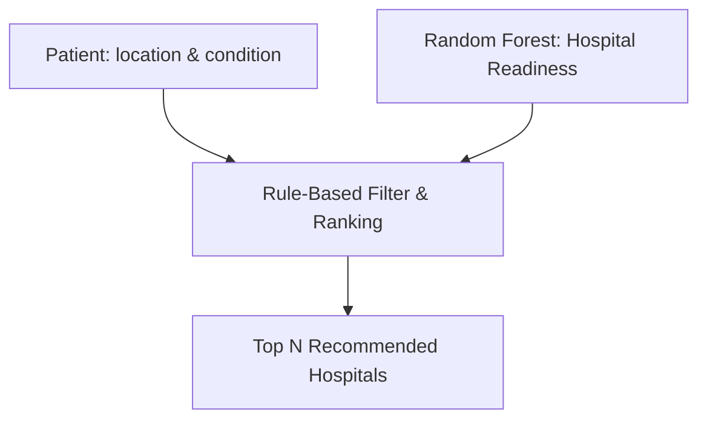
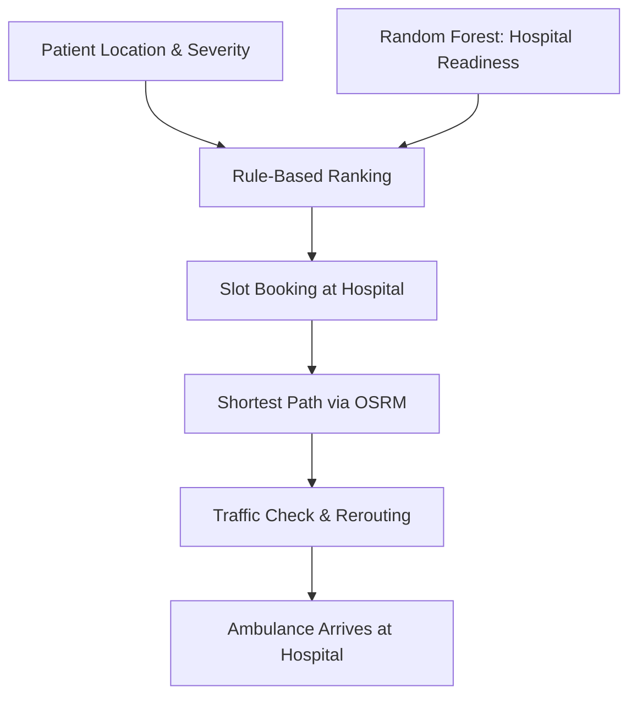

### Real-Time Hospital Readiness & Intelligent Ambulance Routing System  

> 🏆 Hack x Amrita 2.0 – HealthTech Track | 30-Hour Offline Hackathon  
> Amrita Vishwa Vidyapeetham, Amaravati | Feb 23–25, 2026  

---

## 🏥 Problem Statement – Real-Time Hospital Readiness & Ambulance Routing

**Emergency medical services face a critical challenge:** ambulances often take patients to the nearest hospital without knowing if it can provide the required care. The nearest hospital may:  

- Have no ICU beds available  
- Lack ventilators  
- Not have the required specialist on duty  
- Be overloaded with emergency cases  

This leads to:  

- Patients being shifted to another hospital  
- Delays in critical treatment  
- Increased risk to patient survival  
- Wasted emergency response resources  

❗ **Core Problem**  
Existing ambulance routing systems mainly consider **distance and traffic**, but do **not account for real-time hospital readiness**, including:  

- ICU and general bed availability  
- Ventilator status  
- Specialist availability  
- Future overload prediction  
- Patient condition severity  

🎯 **Our Objective**  
We aim to build **DeepCare**, a system that:  

- Predicts **hospital readiness in real time**  
- Evaluates **patient condition severity**  
- Chooses the **best hospital**, not just the nearest  
- Optimizes **ambulance routing** to maximize **patient survival probability**  

**Insight:**  
The problem is **dynamic and critical** — it requires **intelligent decision-making under uncertainty**. DeepCare bridges this gap by combining **real-time data, patient condition analysis, and intelligent hospital ranking** to ensure timely and safe emergency care.

## 🏥 How DeepCare Suggests the Best Hospital

DeepCare intelligently recommends the **best hospital** for a patient by combining **data-driven readiness scores** with **real-time patient information**.  

### 1️⃣ Step 1: Hospital Readiness Score (Random Forest)
- Each hospital’s **capacity to handle emergencies** is calculated using a **Random Forest model**.  
- **Features used:**  
  - `icu_beds` – Number of available ICU beds  
  - `doctor_availability` – Available specialists  
  - `hospital_id` & `name` – For identification (optional)  
  - `location (lat, long)` – Optional for regional patterns  

- **Output:** `readiness_score` (0–1) → higher score = better prepared hospital  

> The Random Forest model captures complex patterns between hospital resources and emergency readiness.

---

### 2️⃣ Step 2: Dynamic Patient Features
- **Patient Location:** Latitude & longitude of patient or ambulance  
- **Patient Severity Score:** Criticality of patient condition  
  - Critical = 1  
  - Urgent = 0.5  
  - Mild = 0.2  

> These features are **calculated at runtime** for each emergency request.

---

### 3️⃣ Step 3: Rule-Based Filtering & Ranking
- Hospitals are **filtered and ranked** using:  
  1. **Patient Severity** → ensures critical patients are sent only to hospitals with ICU & specialists  
  2. **Distance from Patient** → avoids sending patients to very far hospitals  
  3. **Readiness Score** → prioritizes hospitals that are better prepared  

## 🚑 Ambulance Routing to Hospital

DeepCare ensures emergency patients reach the **best hospital quickly and safely** by combining AI-based hospital readiness with dynamic, real-time routing.

---

### **Solution Overview**

1. **Hospital Selection**  
   - Hospitals are ranked based on **Random Forest readiness scores** combined with **rule-based ranking** considering **patient severity** and **distance**.  
   - The top hospital is selected for routing.

2. **Slot Booking (Resource Reservation)**  
   - Before the ambulance departs, a **slot is reserved** at the selected hospital.  
   - Hospital resources are updated in real-time to prevent overbooking.

3. **Dynamic Routing & Traffic-Aware Path**  
   - Compute the **shortest path** from ambulance to hospital using **OSRM**.  
   - Visualize the route, ambulance, and hospital in **Leaflet.js**.  
   - Continuously monitor **real-time traffic**; if a slowdown is detected, recompute an **alternate route** to the same hospital.  

4. **Outcome**  
   - Combines hospital readiness, patient severity, and dynamic routing to provide **fastest, safest, and resource-aware emergency transport**.

---

### **Implementation Diagram**

## 🛠 Tech Stack

### Frontend
- **React.js** – UI development  
- **React Router** – Page navigation  
- **Leaflet.js** – Map visualization  
- **Socket.io Client** – Real-time updates  

### Backend
- **Node.js** – Runtime environment  
- **Express.js** – REST API server  
- **MongoDB** – Database  
- **Mongoose** – Data modeling  
- **Socket.io** – Real-time communication  

### AI & Optimization
- **Random Forest (ML Model)** – Hospital readiness prediction  
- **Rule-Based Ranking Engine** – Severity & distance filtering  
- **OSRM** – Shortest path routing  
